# Rossmann Store Sales

## 1.0 The Problem

This sales prediction project uses data from Rossmann, a Germany-based drug store chain. The dataset is publicly available from a [Kaggle competition](https://www.kaggle.com/c/rossmann-store-sales/overview/).

Rossmann operates over 3,000 drug stores in 7 European countries. Currently, Rossmann store managers are tasked with predicting their daily sales for up to six weeks in advance. Store sales are influenced by many factors, including promotions, competition, school and state holidays, seasonality, and locality. With thousands of individual managers predicting sales based on their unique circumstances, the accuracy of results can be quite varied. 

## 2.0 The solution

To help the managers and the CFO obtain how much each store could sell, a Telegram bot was made. The user need to send the number store and the bot  would answer the predict total sales by the end of the next six weeks.

How to use:
- Seach for RossmannBotPrediction (Username: @rossmann_pred42_bot) in Telegram
- Enter the store number

## 3.0 Solution Steps

In the notebook jupyhter mkmadkm está estruturado como:

### 3.1 Data description

#### Numerical 

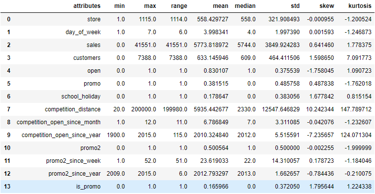

Key points:

- There are 1115 stores in the data.
- The mean sales and the median sales are very close.

#### Categorical

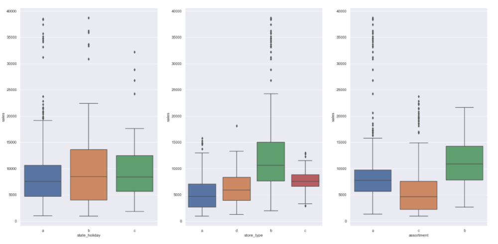

### 3.2 Hypothesis Map

This map helped to decide wich one of the variables were necessary to validate the hypothesis.

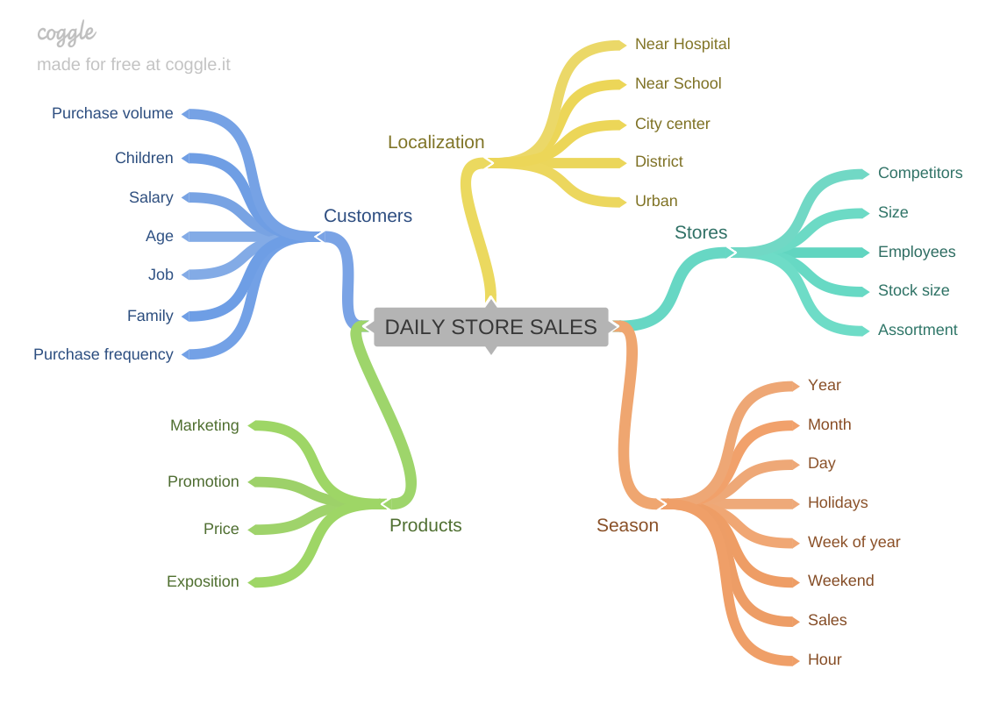

### 3.3 Response variable

We can observe that the distribution does not follow a normal distribution, indicates that there are outliers and may affect the prediction model.

### 3.4 Numerical variable 

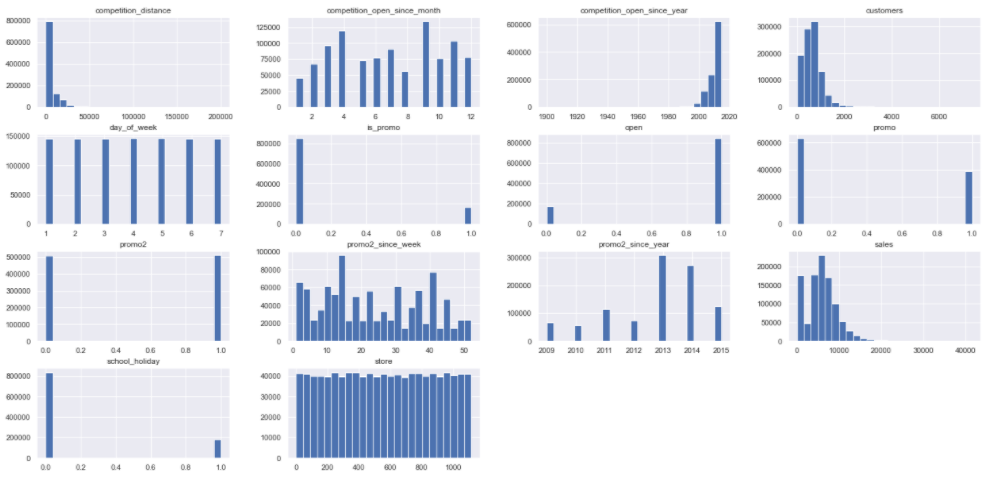

### 3.5 Categorical variable

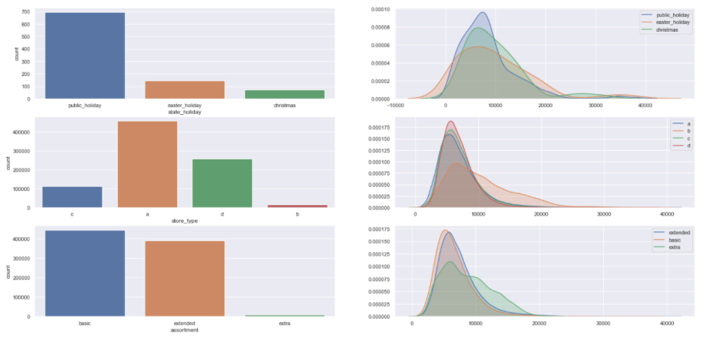

### Hypotesis validation - bivariate analysis

#### H2. Stores with more distant competitors should have higher sales.

#### H8.Stores should have higher sales along the years.

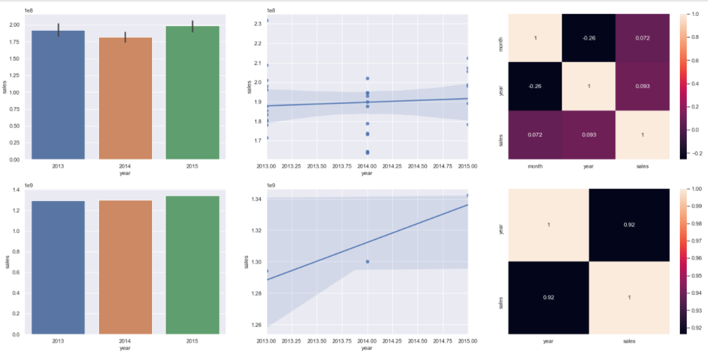

#### H10.Stores should have higher sales after the 10th day of the month.

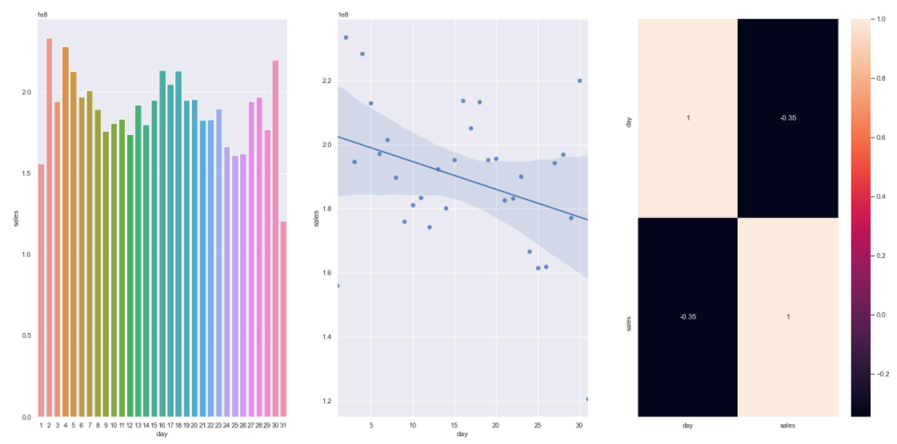

#### Hypotheses summary

### 3.6 Multivariate Analysis

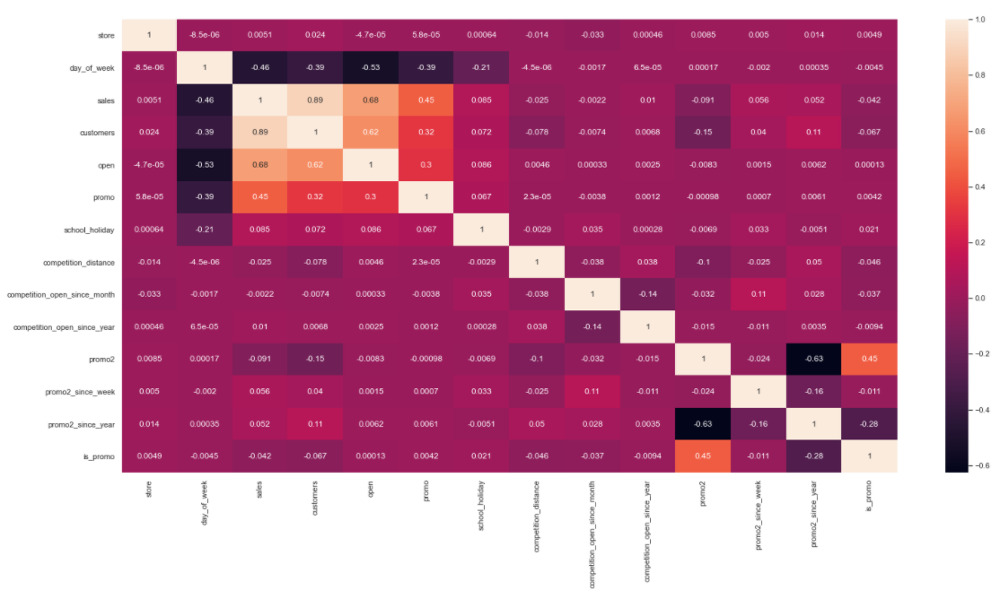

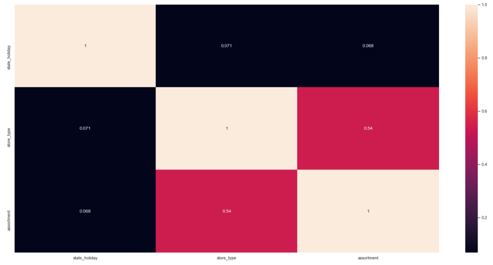

### 3.7 Machine Learning

The Random Forest had the best result. However, i choice the XGBoost regressor because his model requires less storage capacity.

After fine tuning:

There was a great improvement.

#### Business Performance

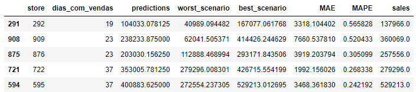

We can observe the results obtained. The predictions with the biggest errors are being shown.

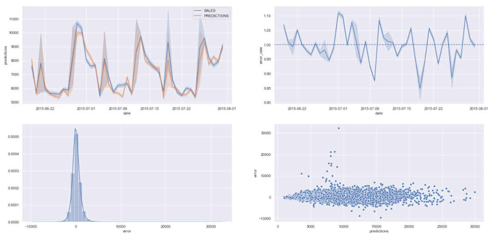

## 4 Next Steps

